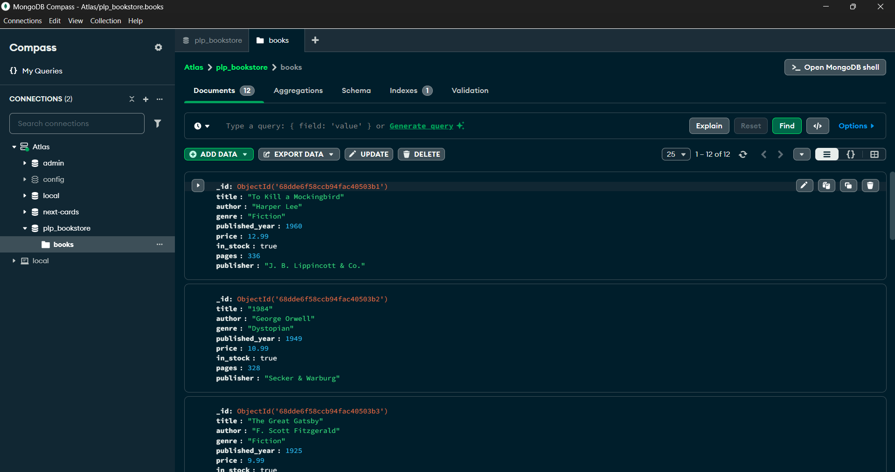

# 📚 PLP Bookstore – MongoDB Data Layer Fundamentals

This project demonstrates the fundamentals of MongoDB, including setup, CRUD operations, advanced queries, aggregation pipelines, and indexing.  
It was built as part of **PLP Week 1 : MongoDB – Data Layer Fundamentals and Advanced Techniques**.

## 🚀 Features Implemented

✅ MongoDB setup with database **`plp_bookstore`** and collection **`books`**  
✅ Inserted sample data (`insert_books.js`) with 10+ book documents  
✅ Basic CRUD operations (find, update, delete)  
✅ Advanced queries: filtering, projection, sorting, pagination  
✅ Aggregation pipelines for data analysis  
✅ Indexing for performance optimization

## Installation & Setup

1. **Clone the repository**

   ```bash
    git clone https://github.com/PLP-MERN-Stack-Development/mongodb-data-layer-fundamentals-and-advanced-techniques-Maithy-a.git
    cd mongodb-data-layer-fundamentals-and-advanced-techniques-Maithy-a
   ```

2. Install dependencies
   ```bash
   npm install
   ```
   Make sure you have dotenv installed:
   ```bash
   npm install dotenv
   ```
3. Configure Environment Variables
   Create a `.env` file in the project root:

   ```bash
   MONGO_URI=your_atlas_url
   ```

4. Insert Sample Data
   Run the script to populate the books collection:
   ```bash
   node insert_books.js
   ```

## Usage

To run queries, open `queries.js` and execute with Node.js:

```bash
node queries.js
```

Alternatively, copy queries into MongoDB Shell (mongosh) or MongoDB Compass to execute manually.

## ⚡ Technologies Used

- Node.js
- MongoDB
- dotenv
- MongoDB Atlas

### 🖼️ Screenshot

Below is the screenshot of my MongoDB collection in Atlas / Compass:


### ✅ Submission Notes

This project includes:

1. `insert_books.js` – to insert data
2. `data.js `- to keep the seeding data separate
3. `queries.js` – all MongoDB queries (CRUD, advanced, aggregation, indexing)
4. `README.md` – documentation
5. images/Compass.png – screenshot of collection
